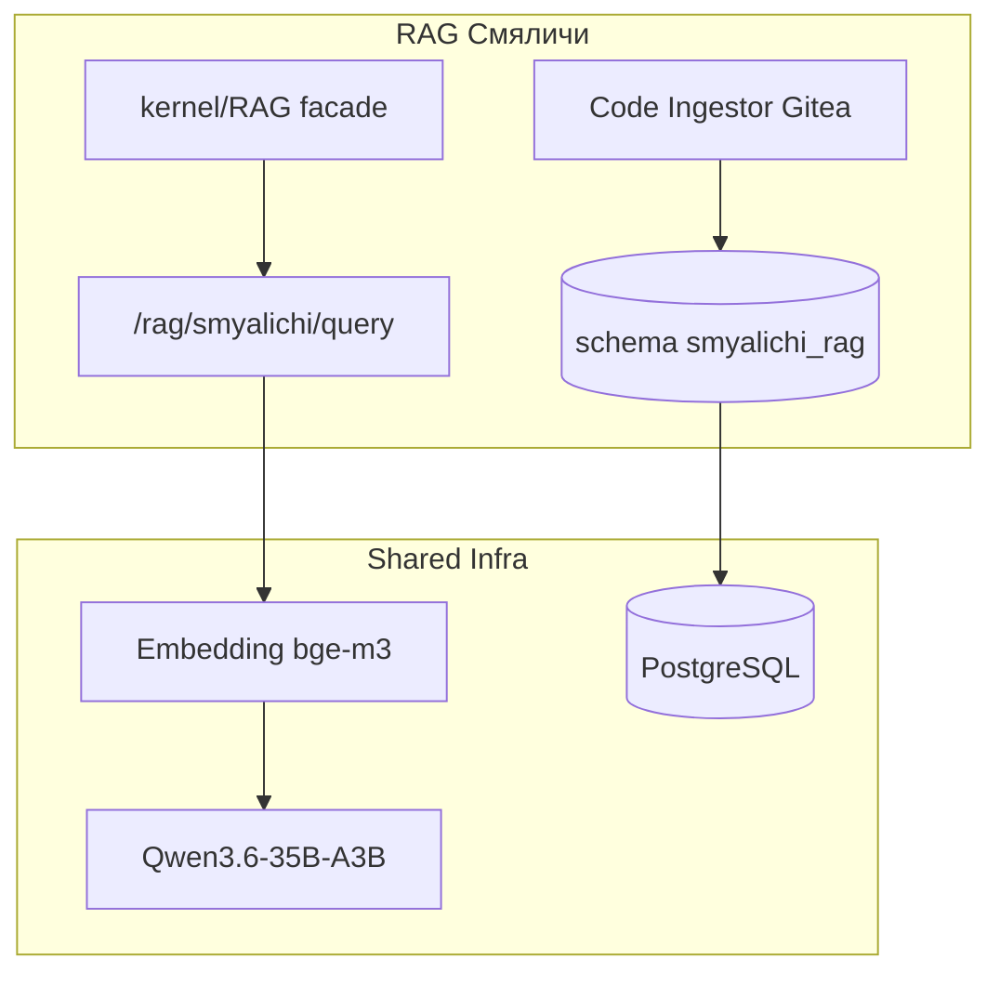
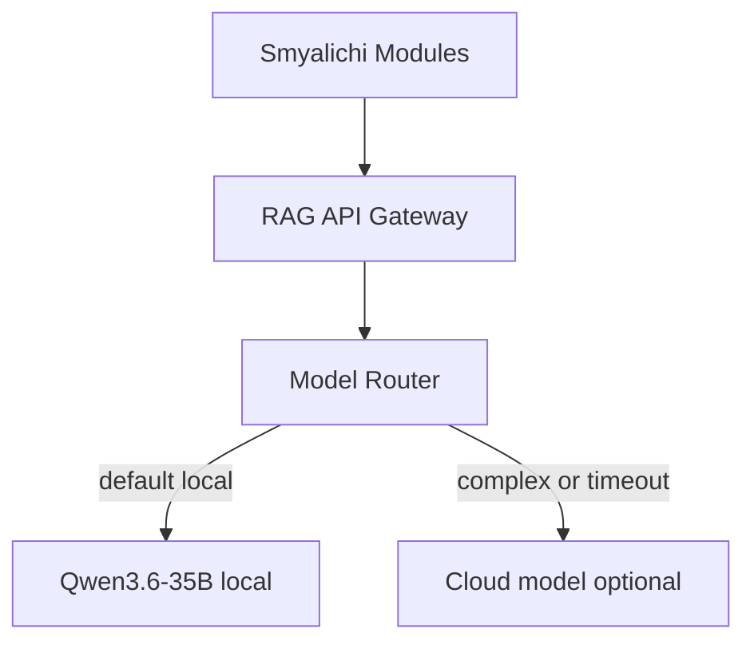

# Deep RAG для Смяличи

## Контекст и репозитории

| Репозиторий | Что содержит | Где |
|-------------|--------------|-----|
| `monitoring-price` (GitHub) | Публичный showcase, только `site` | Текущий `/workspace` |
| **Полный Смяличи** | `price`, `data`, `crm`, `kernel`, парсеры, LLM-пайплайн | **Gitea** (доступ есть) |

RAG в проекте **ещё не реализован**.

**Первый шаг при выполнении:** клонировать полный проект с Gitea, не ограничиваться GitHub showcase.

---

## Ключевое решение: RAG только для Смяличи

`kernel/RAG` нужен как интеграционный слой Смяличи: модулям `price`, `assistant`, `data`, `seo` нужен единый способ вызывать retrieval и LLM-контекст. Тяжёлые части RAG (индексация, embeddings, reranker, vector search workers) лучше держать как runtime-сервис, чтобы не перегружать Symfony-монолит.

**Итоговая схема:**

- `modules/kernel/src/RAG/` — фасад, контракты, DTO, ACL, routing по коллекциям
- `rag-runtime` / `rag-platform` — индексатор, embedding service, hybrid search, workers, LLM gateway
- `smyalichi_rag` — единственная schema/DB в MVP



---

## Что кладём в `kernel/RAG`

```text
modules/kernel/src/RAG/
├── Application/
│   ├── RagQueryService.php
│   └── BuildRagContextUseCase.php
├── Domain/
│   ├── RagQuery.php
│   ├── RagAnswer.php
│   ├── RagCollection.php
│   └── RetrievedChunk.php
├── Port/
│   ├── RagRetrieverPort.php
│   └── RagIndexerPort.php
└── Infrastructure/
    └── HttpRagRuntimeClient.php
```

Модули Смяличи используют только `kernel/RAG`:

- `price` → поиск правил парсинга, fallback-стратегий, похожих источников
- `assistant` → контекст закупок, history, объяснения решений
- `seo` → конкурентный анализ и генерация SEO-гипотез
- `data` → объяснение метрик, дашбордов, аномалий

---

## Что НЕ кладём в Symfony-монолит

- запуск Qwen/Ollama/vLLM
- embedding batch jobs
- reranker
- vector indexing workers

Эти части живут в `rag-runtime`, потому что они resource-heavy и имеют другой lifecycle.

---

## Runtime-инфраструктура

- PostgreSQL-сервер
- Embedding-модель `bge-m3`
- Qwen LLM (один инстанс Ollama/vLLM)
- RabbitMQ workers (`rag.smyalichi`)
- Observability (Langfuse)

---

## Нужен ли Elasticsearch для RAG?

**Краткий ответ: нет, не обязателен на старте.**

| Задача | Elasticsearch | Альтернатива |
|--------|---------------|--------------|
| Семантический поиск | `dense_vector` + kNN | **pgvector** |
| Ключевой поиск | BM25 | **PostgreSQL tsvector** или Meilisearch |
| Гибридный RAG | Vector + keyword | pgvector + tsvector |
| Фильтрация | metadata/facets | PostgreSQL JSONB + индексы |
| Масштаб 10M+ чанков | оправдан | pgvector до ~1-5M чанков обычно хватает |

**Когда Elasticsearch имеет смысл:**

- нужен отдельный полнотекстовый search-кластер поверх RAG
- корпус >5M чанков или жёсткие SLA на latency при сложных запросах
- появились сложные фасеты/агрегации по большому количеству документов

**Рекомендация для Смяличи:** начать с **PostgreSQL + pgvector + tsvector**. Elasticsearch добавить только если метрики recall/latency покажут необходимость отдельного search-кластера.

---

## Архитектура `rag-platform`

```text
rag-platform/
├── core/                    # runtime DTO, indexing contracts
├── ingestors/
│   └── smyalichi/           # Gitea repo: price, data, crm, kernel
├── pipeline/                # chunkers, embedder, indexer
├── retrieval/               # hybrid search, reranker
├── llm-gateway/             # Qwen + optional cloud fallback
├── api/
│   └── smyalichi/           # POST /rag/smyalichi/query
└── workers/                 # queue: rag.smyalichi
```

---

## Symfony-слой в Смяличи (`kernel/RAG`)

```php
// Фасад для всех модулей Смяличи.
interface RagQueryPort
{
    public function ask(RagQuery $query): RagAnswer;
}
```

Пример потребителей:

```php
// modules/price/src/Application/Parser/SuggestParserRuleUseCase.php
$context = $this->rag->retrieve(RagCollection::PRICE_RULES, $source->getUrl());

// modules/assistant/src/Application/Purchase/SuggestPurchaseUseCase.php
$context = $this->rag->retrieve(RagCollection::PURCHASE_HISTORY, $productName);

// modules/seo/src/Application/Competitor/AnalyzeCompetitorUseCase.php
$context = $this->rag->retrieve(RagCollection::SEO_COMPETITORS, $url);
```

---

## Фаза 1: Deep RAG для Смяличи

### Источники знаний

1. **Код и архитектура:** `price`, `data`, `crm`, парсеры, Messenger handlers, Doctrine entities
2. **Доменные правила:** правила сопоставления товаров, валидация LLM, fallback-стратегии
3. **Операционные данные:** схемы конкурентов, форматы источников, anonymized логи ошибок парсинга
4. **Документация:** README, ADR, runbooks, API-контракты
5. **Публичный контент:** блог `templates/site/blog/`

### Chunking

| Тип контента | Стратегия | Размер чанка |
|--------------|-----------|--------------|
| PHP-классы | AST-aware (по методам/классам) | 512-1024 tok |
| Конфиги/YAML | Целые файлы + метаданные | file-level |
| SQL/миграции | По таблице/миграции | 256-512 tok |
| Документы | Semantic chunking | 512 tok, overlap 15% |

### Метаданные чанка

```json
{
  "project": "smyalichi",
  "module": "price",
  "source_type": "code|doc|config|log",
  "path": "modules/price/src/Parser/...",
  "git_sha": "abc123",
  "language": "php"
}
```

---

## Embeddings и Qwen

### Embedding-модель

- Рекомендация: `BAAI/bge-m3` или `nomic-embed-text-v1.5`
- Запуск через Ollama или отдельный embedding-сервис
- Qwen не использовать для embeddings

### Qwen3.6-35B-A3B

| Компонент | Рекомендация |
|-----------|--------------|
| Runtime | Ollama для dev, vLLM для prod |
| API | OpenAI-compatible `/v1/chat/completions` |
| RAG prompt | System + retrieved chunks + citation IDs |
| Context window | 32K+, в prompt 8-12K retrieval |

Важно:

- Reranker улучшит качество retrieval
- top-k после rerank: 5-8 чанков
- Structured output (JSON schema) для задач парсинга/сопоставления

---

## API Смяличи → RAG

```http
POST /api/rag/query
```

```json
{
  "project": "smyalichi",
  "module": "price",
  "question": "Как работает fallback при ошибке парсера?",
  "filters": {
    "source_type": ["code", "doc"]
  },
  "model": "qwen3.6-35b-a3b"
}
```

---

## LLM Gateway Смяличи



Правила роутинга:

- код/архитектура → Qwen local + code chunks
- критичные production-решения → validation layer + optional cloud fallback

---

## Инфраструктура и деплой

| Компонент | Технология | Примечание |
|-----------|------------|------------|
| Vector store | PostgreSQL 16 + pgvector | Уже в стеке Смяличи |
| Queue | RabbitMQ | Переиспользовать |
| Cache | Redis | Кэш embeddings, частых запросов |
| Embedding | Ollama / sentence-transformers | Отдельно от Qwen |
| LLM | Ollama или vLLM | Qwen3.6-35B-A3B |
| RAG API | PHP Symfony microservice или Python FastAPI | Python удобнее для ML-pipeline |
| Observability | Langfuse / OpenTelemetry | Трейсы retrieval + generation |

Dev Compose:

```yaml
services:
  rag-api:
  rag-worker:
  postgres:
  redis:
  rabbitmq:
  ollama:
```

---

## Этапы реализации

### Sprint 1 — Deep RAG Смяличи (Gitea)

- [x] `rag-platform` scaffold, schema `smyalichi_rag` (showcase)
- [x] code ingestor: showcase `site`, `kernel/RAG`, `docs`, `rag-platform`
- [x] embedding + hybrid search + Qwen gateway (с fallback)
- [x] eval: 25 вопросов по парсерам/архитектуре
- [x] `kernel/RAG` PHP facade + HttpRagRuntimeClient
- [x] CI + Docker Compose + DEPLOY.md
- [ ] клон полного репо с Gitea (требует credentials в рантайме)

### Sprint 2 — Интеграция в Смяличи

- AST chunking, parent-child chunks, reranker
- `kernel/RAG` RagQueryPort → `/rag/smyalichi/query`
- admin UI: подсказки по парсерам

### Sprint 3 — Production hardening

- incremental re-index (git webhook Gitea)
- access control, RAGAS metrics
- Elasticsearch — только если метрики покажут необходимость

---

## Решения

- **Полный код:** Gitea (не GitHub showcase)
- **Смяличи RAG:** deep code/domain RAG, клиент в `kernel`, ingestor из Gitea
- **Vector DB:** PostgreSQL pgvector, schema `smyalichi_rag`
- **Elasticsearch:** не нужен на старте
- **Qwen:** Ollama dev / vLLM prod, embedding bge-m3 отдельно

---

## Риски

- Gitea URL/credentials — уточнить при старте выполнения
- 35B MoE — проверить VRAM и квантизацию
